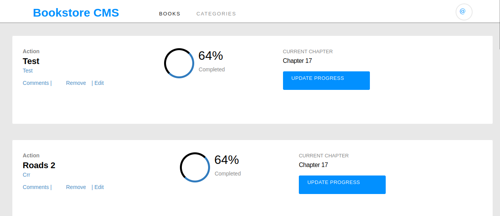

# Project Name

> Bookstore is a book catalog where you can add and remove books, using react and redux.

## Built With

- JavaScript
- Html/CSS
- React & Redux
- Webpack

## Live Demo (if available)

[Live Demo Link](https://maclenn77.github.io/bookstore)

## Getting Started

To get a local copy up and running follow these simple example steps.

`git clone git@github.com:Maclenn77/Bookstore.git`

Or download and unzip

### Prerequisites

- git
- npm
- Code editor (VS Code, Nano, Atom, etc)

### Setup

- Unzip or copy the files

### Install

`npm install` to install all the dependencies needed for the project

## Available Scripts

In the project directory, you can run:

### `npm start`

Runs the app in the development mode.\
Open [http://localhost:3000](http://localhost:3000) to view it in your browser.

The page will reload when you make changes.\
You may also see any lint errors in the console.

### `npm test`

Launches the test runner in the interactive watch mode.\
See the section about [running tests](https://facebook.github.io/create-react-app/docs/running-tests) for more information.

### `npm run build`

Builds the app for production to the `build` folder.\
It correctly bundles React in production mode and optimizes the build for the best performance.

The build is minified and the filenames include the hashes.\
Your app is ready to be deployed!

See the section about [deployment](https://facebook.github.io/create-react-app/docs/deployment) for more information.

### `npm run eject`

### Deployment

`npm run deploy` to deploy to gh-pages

## Authors

👤 **Juan Paulo Perez-Tejada**

- GitHub: [@Maclenn77](https://github.com/Maclenn77)
- Twitter: [@SrJuanPapas](https://twitter.com/SrJuanPapas)
- LinkedIn: [LinkedIn](https://linkedin.com/in/juanpaulopereztejada)

## 🤝 Contributing

Contributions, issues, and feature requests are welcome!

Feel free to check the [issues page](../../issues/).

## Show your support

Give a ⭐️ if you like this project!

## Acknowledgments

- Hat tip to anyone whose code was used
- Inspiration
- etc

## 📝 License

This project is [MIT](./MIT.md) licensed.

# Getting Started with Create React App

This project was bootstrapped with [Create React App](https://github.com/facebook/create-react-app).